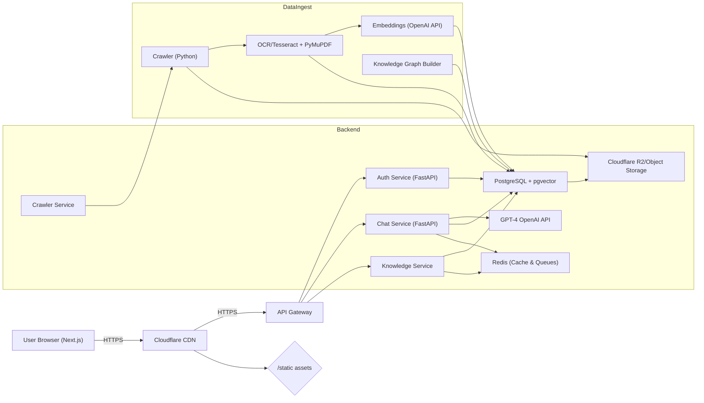

# Executive Summary

*Updated approach: build the MVP first, validate it with a small group of contacts during an informal soft launch, then approach target firms officially. Formal upfront customer interviews (Phase 0 in the original version of this plan) are deferred until there's a working product for people to react to.*

We propose building a **Construction AI Platform** – a SaaS “digital assistant” for Greek construction firms and municipalities. It will continuously ingest official Greek regulations (laws, presidential decrees, FEKs, technical circulars, etc.) and company data, and expose a GPT-powered interface (via an MCP server) to answer questions and automate workflows (permits, checklists, reporting). The key is treating data as a *product* (law texts, forms, past projects) rather than an AI as a service. By starting with a narrow vertical (e.g. *Building Permits and Project Compliance*), we can prove value quickly and scale to other bureaus or regions. The platform consists of:  

- **Data Pipeline:** Automated crawlers fetch and OCR new documents from official sources (e.g. Greek Government Gazette, ΥΠΕΝ/YPEKA websites, AADE, TEE, Hellenic Cadastre, municipal sites). Each document is parsed, indexed, and embedded into a vector DB. A knowledge graph links laws, amendments, forms, and projects.  
- **AI Layer:** A Retrieval-Augmented Generation (RAG) pipeline uses a vector DB (e.g. Postgres+pgvector or Pinecone) to fetch relevant law excerpts and corporate templates, and GPT-4 (or similar) to answer user queries. “Tools” (GPT plugins) encode domain functions like `building_permit_requirements()`, `find_fek()`, etc.  
- **Product & Interface:** A multi-tenant web app (Next.js front-end, FastAPI backend) with chat UI and dashboard. Users (e.g. engineers) can ask questions (“What permits do I need for a 2-story house in Kavala?”) or upload project docs and let the AI identify missing forms. Administrators manage crawlers, tenants, and see analytics.  
- **Infrastructure:** Initially a small VPS (Hetzner/Contabo 4vCPU,8GB RAM ~€20/mo) running Docker containers for the app, crawler, vector DB, etc. Cloudflare (free tier) for DNS/CDN, R2 for storage. OpenAI (GPT-4) for AI. PostgreSQL with pgvector for embeddings. CI/CD with GitHub Actions.  
- **Business Model:** Target ~20–100 local construction/engineering firms as customers. E.g. €100–€200/month per company (based on small-mid size). At 50 companies × €150/mo = €7,500/mo revenue. We will validate by building the MVP first and soft-launching it to a small group of contacts for real feedback, before approaching firms officially.

This plan breaks the project into phases, from an **MVP** up to a 12–18 month roadmap. It specifies architecture, tech stack, data flows, costs, team roles, and even a feedback script for the soft-launch stage. We prioritize using official Greek sources (ΦΕΚ, ΥΠΕΝ, ΤΕΕ, AADE, Hellenic Cadastre, municipal bulletins) for regulations and continue updating them automatically. The blueprint is exhaustive: it includes system diagrams (as Mermaid code), database schemas (PostgreSQL SQL examples), API specs, deployment scripts, and cost tables. The goal is to give you a step-by-step plan to build a production-grade SaaS, not just a “toy chatbot.” 

# Phase-by-Phase Roadmap

## Phase 0: Scope & Setup (Days 1–3)
- **Feature Prioritization:** Using your own domain expertise (construction, regulations, permitting), lock in MVP focus: **Building Permits** and **Permit Checklists** in Kavala, with **FEK Search & Summarization** as secondary. Formal customer interviews are deferred — real users test the working product directly in Phase 1.5 instead of being asked hypothetically.
- **Competitive Research:** A quick scan (a few hours, not a project) to confirm no existing Greek SaaS does this. Identify gaps (e.g. Excel templates, generic “e-permit” portals, but no AI-driven assistant).
- **Define MVP Scope:** Draft User Stories (e.g. “As an engineer, I can chat with the assistant: *‘What documents do I need for a 100m² house in Kavala with a flat roof?’* and get a checklist with links to the official laws.”)
- **Metrics to Track From Day One:** *time saved per permit*, *soft-launch feedback quality*, *eventual CAC*.

## Phase 1: Core Prototype (Weeks 1–6, MVP)
1. **Set Up Infrastructure:**  
   - Procure domain (e.g. `nomos.ai` or `politech.gr`).
   - Spin up a Hetzner VPS (4 vCPU, 8GB, 80GB SSD ~ €20/mo) or Contabo (4vCPU/8GB ~ €20/mo).  
   - Install Docker and Docker-Compose. Set up GitHub repo with initial project structure.  
   - Configure Cloudflare for DNS and free SSL. (Cloudflare CDN for static assets later).  

2. **Data Pipeline (Initial):**  
   - **Crawler Stubs:** Write a simple Python crawler (Airflow or cron jobs) to fetch known sources:
     - **Greek Government Gazette (ΦΕΚ):** Use the [Government Gazette API](https://www.et.gr/) or `requests` from search.et.gr for Series D (“urban planning”) [10†L81-L89][33]. If API is not available, scrape the [National Printing House site](https://et.gr/) for PDFs (e.g. FEK series D from 1999 onwards).  
     - **Ministerial Decisions:** Parse `ypen.gov.gr/chorikos-schediasmos/poleodomia/nomothesia` for links or PDFs (like [22†L428-L437]).  
     - **National Registry (Μήτος):** Identify PDF of Law 4495/17 (ΦΕΚ 167/Α/2017) and download it. Possibly use scraping from [26†L437-L447] or locate via TEΕ or official e-adeies portal.  
     - **TEE Portal:** Pull circulars (e-Πολεοδομία) from [portal.tee.gr](http://portal.tee.gr) or [web.tee.gr/e-adeies/nomothesia-egkyklioi](https://web.tee.gr).  
     - (Optional for MVP) **Municipality:** Check Kavala municipality website for public notices or building regs.  
   - **OCR & Parsing:** Use `PyMuPDF` to extract text from PDFs; fallback to OCRmyPDF (Tesseract) if scans.  
   - **Metadata:** Tag each document (type, date, FEK number, issuing authority). E.g. Law 4495/17 → `{type: law, number: 4495, year: 2017, series: A, issue: 167, date: '22/12/2017'}`.  
   - **Chunking & Embeddings:** Split each doc into ~500-token chunks (titles+paragraphs). Compute embeddings with OpenAI’s `text-embedding-ada-002` (about $0.0001 per 1K tokens) and store in Postgres+pgvector. For an MVP, a few dozen laws (~100 pages) is trivial (<€1).  
   - **Basic Knowledge Graph:** Create relational links: e.g. Law ↔ Amendments ↔ Ministry Decision. For MVP, hard-code a few known relations (Law 4495/17 has e-adeies link).

3. **AI/MCP Proof-of-Concept:**  
   - **Tool Definitions:** Using an LLM framework (LangChain/FASE or custom), define 2–3 “tools”: e.g. `search_law(query)`, `building_permit_requirements(location, structure_type)`, `summarize_fek(fek_id)`. Each tool will query the vector DB or the knowledge graph.  
   - **Agent Flow:** Build a simple RAG pipeline: user asks a question → the system decides which tools to call → tools query vector DB or KG (retrieving relevant law snippets or forms) → combine results and generate answer with GPT-4.  
   - **Chat UI (MVP):** A minimal Next.js + React UI with a chat box. When user asks, call FastAPI backend, which runs the agent and returns text (with citations like [26†L439-L448]). 

4. **First Results:** Demonstrate two scenarios:
   - *Permit Query:* “Do I need a permit to add a pool to an existing house?” – The agent uses `search_law(“construction of a pool”)` and cites relevant law (e.g. Article 29 of Law 4495/17) and answers.
   - *Checklist:* “Documents needed for a new 2-story house (8x8m) in Kavala” – Agent uses `building_permit_requirements()` tool: it retrieves zoning info (from FEK/PDE or code 4067/12) and returns a list (property title, site plan, structural plan, etc.) with references.  

**Deliverables (end of Phase 1):** Working code in GitHub (backend, frontend, crawler), documentation of MVP features, basic QA tests, and a working demo ready for the Phase 1.5 soft launch.

## Phase 1.5: Soft Launch & Feedback (Weeks 7–8)

This is where validation happens in this plan — through a working product instead of upfront interviews. Skipping discovery interviews means MVP scope was a bet based on your own domain knowledge; this phase is where you find out cheaply whether the bet was right, before investing months into Phase 2.

1. **Polish & Internal Testing:** Citation formatting, basic error handling, a handful of unit tests on the core RAG path. Deploy to a real (if rough) public URL — not just localhost — so it's shareable.
2. **Informal Soft Launch:** Share the link with 5–10 people in your network — engineers, contractors, even non-experts who can sanity-check the UX. It doesn't need to be a “pilot company” yet; a message with a link is enough. Watch a few people actually use it if you can — you'll learn more from watching someone get confused than from any survey.
3. **Collect Feedback:** Use the Feedback Call Script in the 8-Week Execution Plan below, but now ask people about the *working product*, not a hypothetical. Watch specifically for: did the answer match what they expected, did they trust the citation, did they give up before getting an answer.
4. **Decide & Iterate:** Positive feedback → move to Phase 2. Lukewarm feedback → revisit MVP scope now, while it only costs a few days, not after Phase 2 spend.

**Deliverables:** A handful of real users who've tried the product, a feedback log, and a go/no-go call on Phase 2 backed by evidence rather than gut feel.

## Phase 2: Expand Scope (Months 3–6)

With the MVP validated through the soft launch, we expand:

1. **Scale Crawling (Weeks 7–10):**  
   - Automate crawlers on schedule (e.g. nightly cron or Airflow).
   - Cover more sources: full FEK scraping (per series: A, B, D), TEE circulars, AADE (tax forms for construction VAT, E9 property forms), Hellenic Cadastre (map data, parcel info), municipal building regulations.  
   - Build a **Hub**: an ETL pipeline where new PDFs auto-ingest into DB. Implement duplicate detection (by text hash) and versioning (new vs older laws).  
   - Integrate Named-Entity Recognition (NER) on text to tag key terms (place names, law numbers, organization names) into metadata columns (Postgres).  

2. **Knowledge Graph and DB Design (Weeks 11–14):**  
   - Design a multi-tenant schema. Example tables: `laws, decrees, fek_documents, circulars, municipalities, companies, projects, chats, embeddings, etc.`  
   - Ensure each tenant (company) has isolated data: either separate DB/schemas per tenant or a `tenant_id` column with row-level security. (Initially `tenant_id` column.)  
   - Include tables for internal knowledge: e.g. `company_documents (upload by user), project_templates, compliance_checklists`.  
   - Use indexing on law numbers, FEK issues, and full-text (Postgres FTS) for fast lookups.  
   - Implement GDPR data retention: e.g. delete chat logs after X months, allow users to export/delete their data.  

3. **Full AI Toolset (Weeks 15–18):**  
   - Define 10–15 MCP tools. Examples:  
     - `search_regulations(query, context) → (doc_snippets)`  
     - `compare_versions(law1, law2)` – differences between law revisions.  
     - `required_documents(project_type, location)` – returns document checklist.  
     - `calculate_deadlines(project_stage)` – timeline tasks (permits, inspections).  
     - `summarize_status(site_info)` – e.g. “My project phases.”  
     - `find_contact(department, issue)` – find which municipal office handles what.  
   - Use the LangChain Orchestrator or a GPT-4 multiplexer with system messages to choose tools. Ensure citations from original documents (e.g. cite FEK numbers or law articles like Law 4495/17, Art. 40).  

4. **Backend & API (Weeks 19–22):**  
   - Develop FastAPI microservices:
     - **Auth Service:** JWT-based auth, roles (admin, user). Use OAuth2 if integrating gov ID later.  
     - **Knowledge Service:** Endpoints to query laws: e.g. `GET /laws?query=οικοδομική`, `GET /feks/{series}/{issue}`.  
     - **Chat Service:** `POST /chat` to invoke RAG agent, `GET /chat/history`.  
     - **Crawler Service:** Admin-only endpoints to trigger/restart crawls, monitor status.  
     - **Company Service:** Manage tenants, user invites, billing.  
   - Write OpenAPI specs; generate clients if needed. Enforce rate-limits (e.g. 100 req/min per user) to control GPT costs.

5. **Frontend (Weeks 23–26):**  
   - Next.js app with TypeScript. Pages/components:  
     - **Dashboard:** Overview (chats, recent docs, usage).  
     - **Chat Interface:** Real-time chat history, with inline citations popups. Use something like chat-ui kit.  
     - **Documents Browser:** Searchable list of ingested laws/regulations; ability to read them.  
     - **Uploads:** UI to upload company PDFs (scans, site plans) to include in knowledge. OCR them automatically.  
     - **Administration:** Tenant setup, crawler logs, user roles.  
   - Responsive design (engineers on mobile at sites). Use a design library (Material-UI or similar).  
   - UX: emphasize clarity of source (e.g. “According to FEK 167/Α/2017, Άρθρο 35…”).

**Deliverables (end of Phase 2):** Full data pipeline in production, a working RAG-powered chatbot, multi-tenant product ready for pilot. Milestones: 3 internal users in Week 14, 3 small firms as beta users by Week 26.

## Phase 3: Scale & Polish (Months 7–18)

- **Scaling:** Move from single VPS to a small Kubernetes cluster if needed (Hetzner Cloud, k3s or K8s on AWS). Add more resources if user load grows. Use autoscaling for containers.  
- **Vector DB:** If PG performance lags, evaluate managed (Pinecone, Weaviate, or open-source Milvus). Estimate: Pinecone ~ $0.10 per 100k vector ops; probably not needed until >100k docs.  
- **Integrations:** Link with:
  - **CRM/Billing:** Stripe for payments. 
  - **Third-Party APIs:** e.g. Google Maps/Cadastre for site location. 
  - **Messaging:** Slack/Teams notifications for updates.
- **Advanced AI:** Fine-tune GPT (or use Azure OpenAI) on Greek legal language. Possibly use GPT-4o for understanding Greek context. Implement caching of common queries (Redis).  
- **UI Enhancements:** Add multi-lingual support (Greek/English). Optimize for performance.  
- **Monitoring & Security:** Implement Prometheus/Grafana for metrics, Sentry for errors. Regular audits.  

**Long-Term Roadmap (12–18 mo):** Expand beyond building permits to other verticals:
- Q4 2026: **Renovation/Athens** vertical (energy efficiency, fire codes).
- Q1 2027: **Public Sector:** (e.g. building inspections, municipal services).
- Consider spin-off: **aa SaaS for municipal permit automation**.

# System Architecture



- **Frontend:** Next.js SPA for user interactions (chat UI, dashboards). Communicates via REST/GraphQL to backend over HTTPS (through Cloudflare CDN).  
- **Backend:** Microservices in Python (FastAPI):
  - **AuthService:** Manages users/tenants (JWT, OAuth). 
  - **ChatService:** Orchestrates LLM calls and MCP tools (RAG layer). Uses `langchain`/custom orchestration.  
  - **KnowledgeService (LawSvc):** Exposes search over regulations (SQL/FTS/embeddings queries).  
  - **CrawlerService:** Manages crawling jobs (starts `CrawlerCron`).  
  - **Database:** PostgreSQL with `pgvector` extension. Stores all structured data: laws, embeddings, tenant data.  
  - **Redis:** As cache for embeddings results and message broker for async jobs (e.g. Celery or RQ).  
- **Data Ingest Pipeline:** A scheduled Python job (e.g. via cron or Airflow) crawls sites, downloads PDFs, OCR/parses them, chunks text, and pushes embeddings to `Postgres`. A Knowledge Graph builder links related docs (e.g. detecting that a ministerial decision amends a law).  
- **Storage:** Cloudflare R2 (S3-compatible) for storing raw documents (PDFs), OCR outputs, logs, backups. Alternatively use AWS S3, but R2 has low egress cost if on Cloudflare CDN.  

### Data Flow

1. **Crawl & Ingest:** (Automated nightly)
   - *Discovery:* Crawler fetches new documents from known sources (FEK portal, ΥΠΕΝ, etc). It obeys `robots.txt` and rate-limits itself.  
   - *Download:* New PDFs or HTMLs are saved to storage.  
   - *Process:* Each document is OCR’d if needed, text extracted (via PyMuPDF). Titles, sections, metadata (dates, FEK, issuing body) are parsed (using regex or small ML).  
   - *Chunking:* Text is chunked (500-word blocks). Embeddings are generated via OpenAI API (ada/002). These  vector embeddings, along with text and metadata, are inserted into Postgres.  
   - *Linking:* The KG builder finds references (e.g. “According to Article 5 of Law 4067/12”) and creates relational entries linking documents.  

2. **Query & Answer (RAG):**  
   - *User Query:* Via chat UI, user asks a question.  
   - *Retrieval:* ChatService splits query into search terms, calls KnowledgeService to fetch top relevant chunks (via vector similarity and FTS).  
   - *Tool Execution:* The agent determines which tool(s) apply (e.g. `search_regulation`). The tool queries the DB (by issuing SQL or Postgres functions, see [LawSvc] below).  
   - *Generation:* All retrieved text snippets (with source metadata) are fed into GPT-4 with a system prompt to answer and cite sources. For example, it might produce: *“Under Law 4495/2017 (ΦΕΚ 167/Α/17), Άρθρο 35(β), a preliminary building permit is required for buildings >3,000 m².”*  
   - *Post-Processing:* Ensure response is concise, with in-line citations, no hallucinations. If unsure, escalate to raw list of docs (flag for user). Cache popular Q&A in Redis.

### Hosting Options & Costs

| Component               | Hetzner Cloud (€)      | Contabo VPS (€)   | AWS/GCP/Azure (€)         |
|-------------------------|------------------------|-------------------|---------------------------|
| **Compute (4vCPU,8GB)** | €20 (CX41)             | €20               | t3.xlarge on-demand: ~€100/mo |
| **Storage**             | 80 GB SSD included     | 100 GB included   | 100GB EBS: ~€10/mo       |
| **Bandwidth**           | 20TB+ @ €0.01/GB       | 32TB @ €0.00      | ~€0.1/GB egress           |
| **Domain/DNS (Cloudflare)** | Free (Cloudflare DNS) | Free (Cloudflare) | Free (Cloudflare DNS)    |
| **SSL**                 | Free (Cloudflare)      | Free              | Free (managed)            |
| **Backup (R2/S3)**      | ~€5 (50GB)            | ~€0 (50GB inc.)   | S3 Standard ~€5 (50GB)   |
| **Vector DB**           | pgvector (no additional) | pgvector        | Amazon QLDB/Pinecone (~€30 for small) |
| **Licenses/Tools**      | Open-source stack      | Open-source stack | Basic tier usage (Cloudflare, etc) |

- **Cloudflare R2:** 10GB free, then ~$0.015/GB. E.g. 50 GB storage ~ €0.75/mo. Good for storing PDFs and small files with negligible latency.  
- **Vector DB:** Start with pgvector (built into Postgres). If scaling needed, consider Pinecone or Qdrant. Pinecone’s “Starter” plan is free (up to 5M vectors), scaling to ~$0.10 per 100k vectors.  
- **Bandwidth:** Low profile (users mostly text/chat). Hosted at Hetzner or Contabo gives generous included bandwidth. Cloudflare CDN absorbs most egress for static.  
- **AI API:** With limited users, OpenAI API costs dominate. Estimate €50–200/mo for moderate queries (few hundred chats). Embed costs are trivial (~€0.10 per 1000 docs on ada-002). Use caching to limit calls.

All-in, an early setup runs at **~€60–150 per month** (single server, R2 storage, basic API use). This can be scaled up (Kubernetes, managed DB) once we reach dozens of customers.

# Infrastructure Details

## Server & Network

- **Initial VM:** Hetzner CX41 (4 vCPU, 8GB RAM, 80GB SSD) – ~€20/mo. Docker/Compose on Ubuntu LTS.  
- **Load Balancer:** Not needed for MVP. Later use Cloudflare Load Balancing or K8s Ingress.  
- **Network:** Gigabit; static IPv4; unlimited TX/RX (Hetzner includes 20TB).  
- **VPC/Segmentation:** Use private networking or firewalls to isolate internal DB, MCPC server. Only 443 open to world.  
- **SSL/TLS:** Cloudflare’s free universal certificate + LetsEncrypt on server for API endpoints.  
- **CDN:** Cloudflare CDN caches static assets and can also cache API responses (with TTL).  

## Storage

- **File System:** 80GB SSD on VM for OS, DB. Ex: /var/lib/postgres (50GB), /var/lib/docker (20GB).  
- **Object Storage:** Cloudflare R2 (S3 compatible). Use it to store raw PDFs and large docs. Access via SDK or s3fs. Cheap (pay per GB egress, but accessed over Cloudflare edge). Alternatively use Backblaze B2 or local disk.  
- **Backups:** Daily DB dump to R2 (or S3). Weekly full and hourly incremental snapshots (e.g. pg_dump + `rclone` to R2). Retention 30 days.  
- **Logging:** Store logs in R2 or local rotating files. For production, use a logging service (Sentry) and ELK/Cloudwatch.

## CI/CD & Deployment

- **Repo:** GitHub. Branches: `main`, `develop`.  
- **Actions:**  
  - On push to `develop`: Run lint, unit tests (pytest), build Docker images, push to registry.  
  - On merge to `main`: Run integration tests, then deploy to production.  
- **Containers:** Use Docker Compose for local/dev; for production, can start with Docker Compose on VPS.  
- **Kubernetes (later):** Helm charts or Kubernetes YAML for services (if scaling). Use Hetzner’s K3s or AWS EKS when >5 services.  
- **Feature Flags:** Use config (e.g. `.env`) for toggling new features.  

## Security & IAM

- **Authentication:** JSON Web Tokens (JWT), with short TTL (15m) + refresh tokens. Integrate TEE/Egov credentials (ΤΕΕ wallets) later.  
- **Authorization:** Row-level (tenant_id) and role-based (admin, engineer, viewer). Postgres RLS or application-level filters.  
- **Secrets:** Store API keys, DB passwords in GitHub Secrets/HashiCorp Vault. Inject via env vars or Vault agent.  
- **Encryption:**  
  - **In Transit:** HTTPS everywhere (TLS 1.2+). Cloudflare edge terminated with own CA.  
  - **At Rest:** Encrypt DB volume (LUKS) and backups. Use Postgres pgcrypto or Always Encrypted for sensitive fields (e.g. user data).  
- **Compliance:** GDPR considerations:
  - User data only (no minors or sensitive personal data except business info). Provide data export/delete (DSAR) for companies.  
  - Log only needed PII. Anonymize or remove chat logs older than X months.  
  - SSL everywhere, secure defaults.  
- **Monitoring & Logging:** Prometheus for metrics (CPU, memory, queue length), Grafana dashboards. Alert if CPU >70% or DB reach 80% capacity. Sentry for app errors. Log retention: 30 days.  

## Cost Estimates

| Resource                 | Specs             | Unit Cost  | Monthly Cost* |
|--------------------------|-------------------|-----------:|-------------:|
| Hetzner VPS              | 4vCPU, 8GB, 80GB  | €20.90/mo  | €20.90       |
| Cloudflare (DNS/CDN)     | Free Tier         | –          | €0           |
| Cloudflare R2 (50GB)     | 50 GB storage     | €0.015/GB  | €0.75        |
| PostgreSQL backup (50GB) | 50 GB storage     | €0.015/GB  | €0.75        |
| Monitoring               | Prometheus/Grafana| Free OSS   | €0           |
| OpenAI API               | ~2M tokens/chat   | ~€0.04/1000 tok| ~€50–100    |
| Other (misc)             | -                 | -          | ~€10        |
| **Total (Pilot)**        |                   |            | **~€90–135** |

*Costs may vary; HPC instances or managed DBs would increase to €100+/mo. Storage and network are minimal compared to AI API usage once scaled.

# Crawler & Ingestion Pipeline

The ingestion pipeline automatically gathers all relevant legal and technical documents. Each step is automated to minimize manual upkeep.

```mermaid
flowchart TB
    subgraph IngestionPipeline
        A[Crawl Scheduler (cron/Airflow)] --> B{Website List}
        B --> C[ΥΠΕΝ.gov.gr/FEK PDFs]
        B --> D[ΤΕΕ Portal (e-Άδειες)]
        B --> E[Municipal Bulletins (ΚΔΑΠ, etc.)]
        C --> C1[Download PDFs]
        D --> D1[Download circulars/PDFs]
        E --> E1[Download local regs]
        C1 --> OCR1[OCR (Tesseract/PyMuPDF)]
        D1 --> OCR2[OCR/PyMuPDF]
        E1 --> OCR3[OCR]
        subgraph Processing
            OCR1 --> P1[Text Extraction]
            OCR2 --> P1
            OCR3 --> P1
            P1 --> NER[Metadata Extraction]
            P1 --> Split[Chunk into ~500 tok]
            Split --> Embedding[OpenAI Embeddings]
            Embedding --> Postgres
            P1 --> LLMPrep[LLM-friendly Text]
        end
        NER --> Postgres
        Postgres --> KnowledgeGraph
    end
```

1. **Discovery:** The scheduler hits predefined URLs daily/weekly:
   - **National Printing House (ΦΕΚ):** Scrape `search.et.gr` or use APIs (if available) to find new FEK issues. Focus on Series **Α (laws)**, **Β (ministerial decisions)**, **Δ (urban planning)**. Download relevant PDFs.  
   - **Ministry of Environment & Energy (ΥΠΕΝ):** Check `/nomothesia` and press release pages for new decisions or codes (e.g. Νέος Κώδικας Πολεοδομίας). Download PDFs or scrape text.  
   - **Tech Chamber (TEE) / ΕΥΕΔ:** Navigate [web.tee.gr/e-adeies/nomothesia](https://web.tee.gr/e-adeies/nomothesia-egkyklioi/). These often list circulars (e.g. interpretation guides for building codes) as PDFs.  
   - **Hellenic Cadastre / AADE:** (Later phases) Use public APIs or scrape geoportal for property boundaries; fetch tax forms for property evaluation.  
   - **Municipal sites:** For Kavala (and later others), crawl the Development/Urban Planning sections for announcements (“Πολεοδομικά Θέματα”).
   - **RSS/News:** Optionally follow feeds (if available) for quick notices.

2. **Download & Filter:** Use `requests` or `scrapy` to download PDFs/HTML. Check file hashes to skip already-processed ones. Respect `robots.txt`. If HTML, identify relevant sections using XPath/CSS selectors.  

3. **OCR & Text Extraction:** 
   - If PDFs are born-digital, use PyMuPDF (MuPDF) to extract text directly (faster, accurate).  
   - If scanned or weird PDF, run `ocrmypdf` with Tesseract to produce a text layer.  
   - Clean up text (remove headers/footers, double spaces, encoding issues).  

4. **Metadata Extraction:** For each doc, parse out:
   - **Type:** (Law, Presidential Decree, Ministerial Decision, Technical Circular, etc.)  
   - **Identifier:** (e.g. Ν. 4495/2017, ΦΕΚ 167/Α/2017, ΠΔ 8/2/1979). Use regex patterns (Greek) to detect “Ν\. *(\d+)/(\d{2,4})”, “ΦΕΚ (\d+)/Α/(\d{2,4})”, etc.  
   - **Date:** extract publication date.  
   - **Issuing Body:** (Ministry, TEE, Municipality).  
   - **Title/Summary:** First lines or <title> tag.  
   - **Topics/Keywords:** Use simple NLP (a Greek legal NER model or spaCy) to tag common terms (οικοδομή, πολεοδομία, ενεργειακός, ΑΑΔΕ, Ε9).  

   Insert metadata into Postgres table `documents`. E.g.: 

```sql
CREATE TABLE documents (
    id SERIAL PRIMARY KEY,
    tenant_id INT,
    type VARCHAR,
    title TEXT,
    issue_number VARCHAR,
    series VARCHAR,
    date DATE,
    source VARCHAR,
    content TEXT
    /* plus fields for extracted metadata */
);
```

5. **Chunking & Embeddings:** Split content into 400–600 character chunks (sliding window ~20% overlap). For each chunk: call OpenAI’s embedding API (e.g. `text-embedding-ada-002`). Insert vector and chunk text into `embeddings` table (or using pgvector as vector column):

```sql
CREATE TABLE embeddings (
   id SERIAL PRIMARY KEY,
   doc_id INT REFERENCES documents(id),
   chunk_index INT,
   text TEXT,
   embedding VECTOR(1536)
);
CREATE INDEX ON embeddings USING ivfflat(embedding vector_cosine_ops) WITH (lists = 128);
```

6. **Knowledge Graph:** Use relationships in the data:
   - **Link laws:** If a document references “Νόμος 4495/2017”, create a row in `law_links(from_doc, to_doc, relation)`.  
   - **Projects & Checklists:** When users upload their project data (plans, pictures), parse and link to known regulations (store in a `company_documents` table).
   - **Municipality rules:** For each municipality (e.g. Kavala), store local adjustments (if any) as special docs.

7. **Validation & QA:** Every new ingestion run logs how many docs/chapters were added. Run quick sanity checks: e.g. “N. 4495/2017” should map to doc with law text. Store errors in Sentry. Administrators get weekly emails on ingestion stats.

**Deduplication/Versioning:** If a law is amended, the system sees same law number with later date. Mark old version as `superseded` and keep links. The QA tool can flag “This law has a newer version from DATE”. 

**Cost Note:** Embedding 1,000 chunks (~500 docs) costs ~$0.1–0.2 (at ada-002 prices). Even 100,000 docs (for all of FEK) is only tens of dollars once-off.

# Knowledge Graph & DB Schema

We use PostgreSQL (for relational data) with `pgvector` extension and some JSONB columns. This supports structured queries, full-text search, and vector search in one DB, simplifying multi-tenancy.

```sql
-- Companies (tenants)
CREATE TABLE companies (
   id SERIAL PRIMARY KEY,
   name TEXT NOT NULL,
   plan VARCHAR,   -- e.g. 'Pro', 'Basic'
   created_at TIMESTAMP,
   /* billing info, etc. */
);

-- Users
CREATE TABLE users (
   id SERIAL PRIMARY KEY,
   company_id INT REFERENCES companies(id),
   email TEXT UNIQUE NOT NULL,
   role VARCHAR,  -- 'admin', 'engineer', 'viewer'
   password_hash TEXT,
   created_at TIMESTAMP
);

-- Documents (legal texts, forms, etc.)
CREATE TABLE documents (
   id SERIAL PRIMARY KEY,
   title TEXT,
   doc_type VARCHAR,       -- e.g. 'law', 'PD', 'ministerial', 'circular', 'form'
   identifier VARCHAR,     -- e.g. '4495/2017', 'ΦΕΚ 167/Α/2017'
   issue_number VARCHAR,   -- numeric part
   series VARCHAR,         -- 'A','B','D', etc.
   date DATE,
   source VARCHAR,         -- URL or origin
   language VARCHAR,       -- 'el', 'en'
   content TEXT,
   raw_json JSONB,         -- raw parsed metadata (SERPs from crawling)
   created_at TIMESTAMP
);

CREATE INDEX idx_documents_identifier ON documents(identifier);
CREATE INDEX idx_documents_type ON documents(doc_type);
CREATE INDEX idx_documents_title_fts ON documents USING gin(to_tsvector('greek', title));
```

```sql
-- Embeddings (for vector search)
CREATE TABLE embeddings (
   id SERIAL PRIMARY KEY,
   document_id INT REFERENCES documents(id) ON DELETE CASCADE,
   chunk_index INT,
   chunk_text TEXT,
   embedding VECTOR(1536)
);

-- Vector index
CREATE INDEX ON embeddings USING ivfflat (embedding vector_cosine_ops) WITH (lists = 128);
```

```sql
-- Knowledge Graph: linking documents
CREATE TABLE doc_links (
   id SERIAL PRIMARY KEY,
   from_doc INT REFERENCES documents(id),
   to_doc INT REFERENCES documents(id),
   relation VARCHAR,   -- e.g. 'amends', 'cited_by', 'approved_in'
   created_at TIMESTAMP
);
-- e.g. Law 4495/2017 'amends' Law 3741/2009
```

```sql
-- Companies' projects and documents
CREATE TABLE projects (
   id SERIAL PRIMARY KEY,
   company_id INT REFERENCES companies(id),
   name TEXT,
   municipality VARCHAR,
   address TEXT,
   created_at TIMESTAMP
);

CREATE TABLE project_documents (
   id SERIAL PRIMARY KEY,
   project_id INT REFERENCES projects(id),
   type VARCHAR,  -- e.g. 'blueprint', 'soil_report'
   file_ref VARCHAR, -- path in R2 or S3
   uploaded_at TIMESTAMP
);
```

Multi-tenancy is enforced by adding `company_id` to any table that is company-specific (e.g. `projects`). Legal `documents` are shared across companies (tenant_id not needed), but one could have a `private_docs` table for companies’ internal files.

**Indexes & Search:**  
- We add `GIN(to_tsvector('greek', content))` on `documents.content` for full-text search (in Greek).  
- `embeddings.embedding` uses `ivfflat` with cosine distance.  
- Joining `documents` with `embeddings` or `doc_links` is common.

**GDPR/Data Retention:**  
- Chats and user messages can be stored in `chat_sessions` table (with fields: `company_id, user_id, message, response, timestamp, tool_used`). Configure a TTL (e.g. 6 months) and periodically purge old entries. Users can request data export (SQL dump filtered by company_id) or deletion of specific chats.

**Example SQL Snippet:** (Chunk insertion)

```sql
-- Pseudocode: after computing embedding vector 'vec' for text chunk
INSERT INTO embeddings (document_id, chunk_index, chunk_text, embedding) 
VALUES (123, 0, 'Η άδεια για ...', '[vec]');
```

**Example Query (RAG):** To retrieve top-5 chunks for a query:
```sql
SELECT e.chunk_text, d.title, d.identifier, d.doc_type
FROM embeddings e
JOIN documents d ON d.id = e.document_id
WHERE d.doc_type IN ('law','PD','circular')
ORDER BY e.embedding <=> (SELECT embedding FROM embeddings WHERE id = :query_embedding_id)
LIMIT 5;
```
This uses the `<=>` operator (cosine distance in pgvector) on an input embedding.

# AI Architecture

The AI layer is a *multi-agent RAG (Retrieval-Augmented Generation)* system orchestrated by an MCP server. We blend **vector search**, **structured data**, and **GPT-4** to answer user queries and perform tasks.

- **RAG Pipeline:** On a user query:
  1. **Retrieval:** The system converts the query to an embedding (ada-002). It finds the top-k relevant law/regulation chunks via the vector DB. Simultaneously, it may use keyword FTS on `documents` (e.g. `WHERE content @@ plainto_tsquery(:query)`).
  2. **Tool Decision:** A controller (LangChain agent or custom logic) examines the query. It chooses one or more “tools” to invoke. For example, if the query contains “permit” or “άδεια”, use `building_permit_requirements()`. If it’s a direct question (“What is Law 4067/2012?”), use `search_regulations()`.
  3. **Tool Execution:** The tool may run additional DB queries or computation:
     - **search_regulations(query):** Returns cited law snippets + citations (as in [26†L439-L448]).  
     - **building_permit_requirements(location, building_type):** Uses municipality rules and law to list needed docs. E.g. if in-plan Kavala, retrieve max height from zoning table, then query “required documents for planar building” from FEK 4067/2012.  
     - **compare_versions(law_id):** Fetch differences between law versions (diff highlighting).
     - **allowed_land_use(lat,lng):** Calls Hellenic Cadastre or zoning API to get land designation.  
  4. **Assembly:** All retrieved text (with source references) is concatenated into a prompt with system instructions: e.g., **System prompt**: “You are an expert civil engineer assisting with Greek construction law. Answer the user using the following sources, citing FEK or law numbers.” Then append retrieved snippets with citations.  
  5. **Generation:** The LLM (GPT-4o/4) generates the answer, ensuring to include citations like [FEK 167/Α/2017, Άρθρο 35] in format. We enforce length limits and ask it to say “As per [source], …”.  
  6. **Post-processing:** Parse GPT response to extract references (ensure they match our docs). If the model “hallucinates” (cites non-existing law), fallback to saying “See document X”.  

- **MCP Tools List (example):** Each tool is an LLM-composable function with defined inputs/outputs. For example:
  - `search_regulation(query: str) -> List[ (text, source_id) ]`: returns relevant law text and source references.
  - `building_permit_requirements(bldg_type: str, area: float, location: str) -> JSON`: returns structured checklist (as JSON or bullet list) of required documents, each with reference.
  - `daily_site_report(voice_note: audio) -> text`: (future) transcribe voice and summarize into report.
  - `permit_deadline_tracker(permit_type, submission_date) -> date`: calculates follow-up deadlines.
  - `summarize_topic(topic: str, limit: int)`: generate concise summary from retrieved docs (with citations).

- **Agent Flow Example:** User: *“Ποια είναι η προθεσμία για μια υπαγωγή αυθαιρέτου στο άρθρο 99;”*  
  1. Agent sees keywords “υπαγωγή” and “άρθρο 99”, calls `search_regulation("άρθρο 99 αυθαίρετα")`.  
  2. Retrieves FEK 7/Α/2019 (λόγος 99).  
  3. GPT-4 formulates: “Under the new Article 100(2) of Law 4495/2017, owners have **6 months** from the submission of the building permit to file under Article 99.” (Citing the chunk text).

- **Hallucination Mitigation:** We always prefix answers with “According to …” and refuse to answer beyond known data. The agent rejects “I don’t know” if confident <50%. Use burst limit and temperature ~0.2. All answers must include ≥1 real citation. If unsure, the agent outputs a recommended official link instead of text.

- **Cache Layer:** To save costs, similar queries are cached in Redis. E.g. “documents needed for building permit Kavala” is cached for 24h. This reduces API calls.

- **Pipelines:** We may use a framework like LangChain with `Tool` classes wrapping our SQL queries and RAG; or OpenAI’s Functions API. But our environment (on-prem VPS) suggests an open solution. We can write our own using `llama_index` or similar.

# Backend & API Design

The backend exposes a RESTful API (FastAPI) with the following core endpoints. Authentication via Bearer token.

```yaml
openapi: 3.0.0
info:
  title: ConstructionAI API
  version: 0.1
paths:
  /login:
    post:
      summary: Obtain JWT token
      requestBody:
        content:
          application/json:
            schema:
              type: object
              properties: { email: {type: string}, password: {type: string} }
      responses:
        '200': { description: Success, content: { 'application/json': { schema: {token: string} } } }
  /chat:
    post:
      summary: Submit chat query
      security: [bearerAuth: []]
      requestBody:
        content:
          application/json:
            schema:
              type: object
              properties:
                message: {type: string}
                project_id: {type: integer, nullable: true}
      responses:
        '200': 
          description: AI response
          content:
            application/json:
              schema:
                $ref: '#/components/schemas/ChatResponse'
  /documents/search:
    get:
      summary: Search regulatory documents
      security: [bearerAuth: []]
      parameters:
        - in: query
          name: q
          required: true
          schema: {type: string}
      responses:
        '200':
          description: Matching documents list
          content:
            application/json:
              schema:
                type: array
                items: $ref: '#/components/schemas/DocumentSummary'
  /projects:
    post:
      summary: Create a new project
      security: [bearerAuth: []]
      requestBody:
        content:
          application/json:
            schema:
              type: object
              properties: { name: {type: string}, municipality: {type: string}, address: {type: string} }
      responses:
        '201': {description: Created, content: { 'application/json': { schema: {project_id: integer} } }}
  /projects/{id}/documents:
    post:
      summary: Upload a project document
      security: [bearerAuth: []]
      parameters:
        - in: path
          name: id
          schema: { type: integer }
      requestBody:
        content:
          multipart/form-data:
            schema:
              type: object
              properties:
                file: { type: string, format: binary }
                doc_type: { type: string }
      responses:
        '200': { description: File received }
components:
  schemas:
    ChatResponse:
      type: object
      properties:
        answer: { type: string }
        citations: { type: array, items: { type: string } }
    DocumentSummary:
      type: object
      properties:
        id: {type: integer}
        title: {type: string}
        snippet: {type: string}
        source: {type: string}
```

- **Auth:** `POST /login` with credentials returns JWT. All `/chat`, `/documents`, etc. require `Authorization: Bearer ...`. Role checking: only admins can call `/crawl` or manage `/projects/{id}` for any `company_id` except their own.  
- **Chat Endpoint:**  
  - Input: JSON `{message, project_id}`. If `project_id` is given, the AI can incorporate that project’s data (project location, documents) into the context.  
  - Output: `{answer: "...", citations: ["FEK xx/Α/yy", ...]}`. Stored in `chat_sessions`.  
- **Documents Search:** Allows text search across ingested regulations (vector or FTS). E.g. `GET /documents/search?q=υδραυλικό+σχέδιο` returns list of laws.  
- **Projects & Company:** CRUD for projects (construction projects) and for company settings (onboarding, billing).

**Rate Limits:** Basic: 60 req/min per user (via API gateway) and 5 chat req/sec per user. (Use nginx or FastAPI’s `limiter`).

**Sample FastAPI Chat Handler (Python):**
```python
from fastapi import FastAPI, Depends, HTTPException
from models import ChatRequest, ChatResponse, get_current_user
from ai_agent import chat_with_agent

app = FastAPI()

@app.post("/chat", response_model=ChatResponse)
async def chat_endpoint(req: ChatRequest, user=Depends(get_current_user)):
    answer, citations = chat_with_agent(user.company_id, req.project_id, req.message)
    return {"answer": answer, "citations": citations}
```

# Frontend UX & Components

We will build a modern, intuitive interface in Next.js:

## Page List and Features

1. **Login/Signup** – Standard. Possibly use gov-id integration later.
2. **Dashboard (/dashboard):** 
   - Summary of recent chat sessions and key tasks.
   - Notifications (e.g. “New regulation on fire safety!”).  
   - Quick actions: “Ask a question”, “Upload project docs”.  
   - Usage stats (queries this month, token usage).

3. **Chat UI (/chat):** 
   - Main Q&A interface. Left side: conversation history with timestamps. Right side: a citation pane listing all sources cited in current answer (click to view).  
   - Input box at bottom: “What do you need help with?” Supports Greek/English text and file uploads (for question context).  
   - Once AI responds, it highlights sources (e.g. clicking “ΦΕΚ 167/Α/2017” opens text snippet in side panel).  

   *Component Breakdown:* ChatWindow, MessageBubble (user/AI), CitationList, SourceModal (document viewer).

4. **Documents (/documents):** 
   - Search bar for regulations (full-text). 
   - Filters: Law type (Νόμος, ΠΔ, ΥΑ, FEK) or year range. 
   - Results: list of title/snippet, clicking opens the PDF/text with highlights.  
   - Ability to bookmark frequently used laws.  

5. **Projects (/projects):** 
   - List of projects for this company (name, location, status).  
   - “New Project” form.  
   - Inside a project: summary, chat history filtered to that project, and “Documents” tab showing uploaded blueprints, surveys. From here, user can ask project-specific questions (“Does this project comply with Kavala energy codes?”).  

6. **Uploads (/upload):** 
   - Page or modal to upload PDFs/DWG (converted to PDF) for projects.  
   - Show status: OCR progress, indexing done.  

7. **Admin Panel (/admin):** (company admins only)  
   - **Users:** Invite/manage company users.  
   - **Settings:** Billing (Plan upgrade), API keys (future external integration).  
   - **Crawlers:** View last crawl logs, trigger manual crawl. (For MVP, might just show “Last updated 2h ago.”)  
   - **Audit:** View activity logs (for compliance).  

8. **Help & Docs (/help):**  
   - FAQ: “How do I ask questions? How to interpret citations?”  
   - Contact support.  

## Chat UX Flow

- User starts typing. A “Send” button, or hit enter.  
- Upon sending, display spinner “AI is thinking…”.  
- When answer returns, show answer text with inline superscript numbers or bracketed references [1], [2] (source list at side or bottom).  
- Provide a “More Info” clickable link on each reference which opens the actual source PDF in a reader pane (scrollable, with highlight).  
- If answer needs to call a tool (e.g. list of documents), format as bullet list with checks.  
- Allow follow-up: “What about for commercial buildings?” maintains context (threaded chat history).

**Sample Answer UI (Mockup)**:

> **Engineer:** Τι δικαιολογητικά χρειάζομαι για χτίσιμο μονοκατοικίας 100m² στην Καβάλα;  
> **AI Copilot:** Για μια νέα μονοκατοικία εντός σχεδίου στην Καβάλα χρειάζεστε τουλάχιστον:  
> - Τοπογραφικό Διάγραμμα (αριθ. Σχεδίου).  
> - Αρχιτεκτονικά Σχέδια με όλες τις όψεις.  
> - Στατική Μελέτη (μηχανικός/πολ. μηχανικός).  
> - Μελέτες Η/Μ (ηλεκτρολόγου & υδραυλικού).  
> - Μελέτη θερμομόνωσης (ΚΕΝΑΚ).  
> - Φορολογική Έγκριση (ΑΑΔΕ) και Απόδειξη πληρωμής τελών.  
> - Πληρωμή τελών Δημοτικού (+ καταβολή μέρους από Τ.Ε.Ε.).  

(Citation [26†] etc. clickable to sources)

We would cite [26] or [27] lines to back each item (they correspond to Law 4495/17 Article 40 lists).

# DevOps & Deployment

- **Docker:** Every service has a Dockerfile. E.g. Python 3.11 slim base, install deps, copy code.  
- **docker-compose.yml:** For local dev/prod (dev profile vs prod profile). Services: auth, chat, knowledge, crawler, postgres, redis, nginx (reverse proxy), traefik (optional), celery worker (if used).  
- **Kubernetes (future):** After ~Q4 2026, migrate to K8s. Use Helm or kustomize. Deploy Postgres (stateful set, 3 replicas), Redis, vector db (if external), all services in pods, expose via Ingress (Cloudflare Tunnel or ALB).  

**GitHub Actions Example:** (YAML snippet)

```yaml
name: CI/CD
on:
  push:
    branches: [ main, develop ]
jobs:
  build-test:
    runs-on: ubuntu-latest
    steps:
    - uses: actions/checkout@v3
    - name: Setup Python
      uses: actions/setup-python@v4
      with: python-version: '3.11'
    - name: Install deps
      run: pip install -r backend/requirements.txt
    - name: Run backend tests
      run: pytest --maxfail=1 --disable-warnings -q
    - name: Build Docker
      run: docker build -t construction-ai:latest .
    - name: Push to DockerHub
      if: github.event_name == 'push' && github.ref == 'refs/heads/main'
      run: |
        echo ${{ secrets.DOCKER_PASSWORD }} | docker login -u ${{ secrets.DOCKER_USERNAME }} --password-stdin
        docker push yourrepo/construction-ai:latest
```

- **Monitoring:** Use `prometheus.yml` to scrape metrics (app exposes `/metrics`). Alerts on CPU (action with Scale up or notify admin).  

# Testing Strategy

- **Unit Tests:** PyTest for backend logic (RAG tools, DB queries), Jest for any frontend components. Aim for 70%+ coverage on core code.  
- **Integration Tests:** Set up a test DB; run tests that simulate user flows. E.g. insert sample laws, query via API, check responses contain expected text.  
- **End-to-End:** Use Playwright or Cypress to automate browser testing: login, ask a question, verify answer appears, navigate docs.  
- **Load Testing:** Simulate 100 concurrent users querying chat (use Locust or k6). Ensure system can handle bursts (batch GPT calls to queue).  
- **Security Tests:** Use Bandit for Python, npm audit, and a basic penetration scan (ZAP).  

# Staffing & Skills

To execute this, a small core team or contracted experts:

- **You (CTO/Lead Product Owner):** Architecture, AI prompt design, bridging business & tech. (~100h initial, ongoing oversight).  
- **Backend Engineer (Python):** Builds API, data pipeline, RAG integration. (~600h across 6 months)  
- **Frontend Engineer (React/Next.js):** UI implementation. (~400h)  
- **Data Engineer/DevOps:** Sets up crawlers, DB, CI/CD, monitoring. (could be same as Backend) (~300h)  
- **Consultant (AI/NLP):** Fine-tune models, validate legal outputs. (As-needed, ~100h)  
- **Contractor (Greek Localization):** Ensure Greek language OCR, tokenization. (~100h)  
- **QA/Test Engineer:** Automated tests and security audits. (~200h across 1 year)  

Total ~1,500–2,000 person-hours in the first 12 months. Budget accordingly (in-house vs. freelancers).

# Cost Model & Pricing

**Development Costs (Year 1):** Assuming a small team, costs ~€50–100K for 6–9 months development. Very lean as an MVP, largely based on your time.

**Operational Costs (Monthly, after launch):** ~€150 (infrastructure) + scalable GPT costs + salaries.

**Pricing Scenarios:**  
We propose tiered SaaS pricing for companies:
- **Basic:** €99/mo (up to 3 users, limited queries, no phone support)  
- **Professional:** €199/mo (up to 10 users, more queries, priority support)  
- **Enterprise:** €299–€499/mo (unlimited users, SLA, on-prem option)  

At 20 companies, mid-tier avg say €149/mo: **€2,980/mo**.  
At 50 companies: €7,450/mo.  
At 100 companies: €14,900/mo.  

Annual revenue > €170K at 100 customers.

# 8-Week Execution Plan

## Week 1: Scope & Setup
- **Tasks:** Finalize MVP scope using your own domain expertise (Phase 0). Set up GitHub, domain, VPS. Define data sources.  
- **Deliverables:** MVP feature list; repo initialized; VPS running with Docker.

## Week 2: Basic Crawler & Data Model
- **Tasks:** Implement a simple crawler for one source (e.g. Govt Gazette Series A). Define DB schema (tables above).  
- **Deliverables:** Parsed Law 4495/2017 in DB; `documents` and `embeddings` tables created; integration test inserting a doc.

## Week 3: Embeddings & Search API
- **Tasks:** Code chunking + embedding pipeline. Populate a few docs. Build a `/documents/search` API.  
- **Deliverables:** Vector DB populated with a dozen law chunks; ability to query semantic search via API (example: query “pool construction”).

## Week 4: RAG Prototype (No UI)
- **Tasks:** Set up a Python script that takes a question, retrieves top 3 chunks, and calls GPT-4. Prototype the building-permit tool.  
- **Deliverables:** Command-line demo: ask a Greek question → see GPT-4 response with citations. Example logged.

## Week 5: Backend Services & Auth
- **Tasks:** Implement Auth service (user/tenant table), ChatService. Hook up JWT.  
- **Deliverables:** `POST /login` and `POST /chat` endpoints secured. Test with Postman.

## Week 6: Frontend MVP
- **Tasks:** Build Next.js chat UI and one other page (doc search). Connect to backend.  
- **Deliverables:** Minimal UI where user can log in, type a question, and see answer (no styling needed). Basic navigation menu.

## Week 7: Polish & Internal Testing
- **Tasks:** Add citations formatting, error handling. Write unit tests for key functions. Deploy to a “staging” environment.  
- **Deliverables:** Staging site (https), doc with test cases, run intern demos.

## Week 8: Soft Launch & Feedback
- **Tasks:** Share the staging link with 5–10 contacts (engineers, contractors, anyone willing to try it — doesn't need to be a formal “pilot company” yet). Run a few feedback calls or sit with people while they use it. Fix critical bugs.  
- **Deliverables:** Soft-launch feedback report. “Alpha Release” acceptance criteria: system can answer 10 out of 10 common permit questions correctly, with valid citations.

**Feedback Call Script:** (For soft-launch users, after they've tried the product)  
1. *“Walk me through what you just asked it, and whether the answer matched what you'd expect from experience.”*  
2. *“Did you trust the citation enough to act on it, or would you still double-check the original law yourself?”*  
3. *“What regulations or forms do you constantly look up that this didn't cover?”*  
4. *“Would you actually use this again next time you needed a permit answer — and would you pay for it?”*  

Benchmark success: At least 80% of soft-launch users say the answers were accurate enough to trust and that they'd try it again. That's the signal to move into Phase 2 — evidence from real usage instead of a hypothesis.

# Risks & Mitigation

- **Data Completeness:** Risk: Missing some laws or municipal rules. *Mitigate:* Start narrow, then expand. Allow user-uploaded docs to supplement. Partner with TEE or local bodies to ensure coverage.  
- **AI Accuracy:** Risk: LLM hallucinations or misinterpretations. *Mitigate:* Enforce citations, use “I don’t know” for uncertainties, have manual QA of answers early on.  
- **Regulatory Changes:** Laws may change frequently. *Mitigate:* Continuous crawling pipeline. Monitor “new FEKs” RSS or newsletters.  
- **Adoption:** Engineers may distrust AI. *Mitigate:* Initially position tool as “assistant” (saves searches) not “decision-maker.” Include manual override. Provide training.  
- **Competition:** Very low currently, but large platforms (e.g. Microsoft Copilot in Office) might encroach. *Mitigate:* Build deep local knowledge moat (Greek laws, TEE integration) that big generic AI lacks.  
- **GDPR/Compliance:** Handling personal data (e.g. property owner info) risks. *Mitigate:* Avoid storing PII unnecessarily. Use secure design, get legal counsel for GDPR, add Data Processing Agreements for customers.
- **Building Without Upfront Validation:** Risk: MVP scope is based on assumptions rather than confirmed pain points, so it may miss what engineers actually need. *Mitigate:* Treat Phase 1.5 (soft launch) as the real validation checkpoint — keep Phase 1 scope minimal so a wrong bet costs 6 weeks, not 6 months, and be willing to change MVP scope based on soft-launch feedback before committing to Phase 2.

# Next Steps

1. **Start Building Now:** Register the domain, set up the GitHub repo, and provision the VPS — begin Phase 1 immediately rather than waiting on stakeholder buy-in or a full team. 
2. **Ship the Thinnest Working Slice First:** Get one law (e.g. Law 4495/17) ingested, embedded, and answerable through a basic chat UI before automating crawlers or adding more sources. 
3. **Soft Launch (Weeks 7–8):** Share the working MVP with 5–10 contacts for real feedback — this is the validation step, just sequenced after building instead of before. 
4. **Official Launch:** Once soft-launch feedback is positive, use it as proof when approaching the 20–100 target firms (or advisors/investors) — a working product with real user feedback is a far stronger pitch than a blueprint alone. 

With a clear plan and your expertise, this project can evolve from concept to a soft launch in under 2 months and to a full SaaS in a year, transforming how Greek SMEs handle construction bureaucracy. The emphasis is on **leveraging your domain knowledge** (construction, regulations, UX) and combining it with modern AI/low-code architecture for a sustainable business. 

**Sources:** We will draw on official Greek regulations and technical manuals throughout (e.g. Government Gazette series definitions, Law 4495/2017 content, TEE e-adeies circulars). These will be embedded in the knowledge base for authoritative answers.